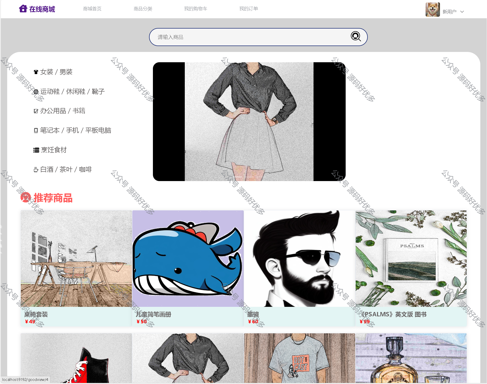

 
## 查看主页获取源码

> **作者介绍**： **✌**全网粉丝10W+本平台特邀作者、博客专家、CSDN新星计划导师、软件领域优质创作者,博客之星、掘金/华为云/阿里云/InfoQ等平台优质作者、专注于项目实战 **✌**

  

### 一、作品包含

源码+数据库+设计文档万字+全套环境和工具资源+部署教程

### 二、项目技术

前端技术：Html、Css、Js、Vue、Element-ui

数据库：MySQL

后端技术：Java、Spring Boot、MyBatis

  

### 三、运行环境

开发工具：IDEA/eclipse

数据库：MySQL8.0

数据库管理工具：Navicat10以上版本

环境配置软件： JDK1.8+Maven3.6.3

前端Nodejs：16

  

### 四、项目介绍
项目编号：springbootA015

（1）商品管理模块：实现了商品的基本信息录入、图片上传、状态管理等相关功能。
（2）商品分类模块：实现了分类的增删改查、分类层级管理、商品分类的关联等功能。
（3）订单管理模块：实现了订单的查询、创建、删除、退货等功能。
（4）用户管理模块：实现了用户的注册、登录、密码找回、个人信息修改和查询等功能。
（5）购物车管理模块：实现了添加商品、删除商品、调整数量、结算等功能。

### 五、运行截图

